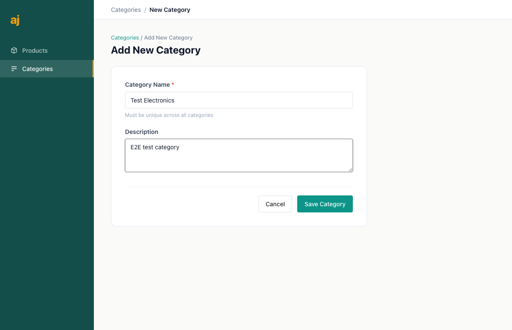
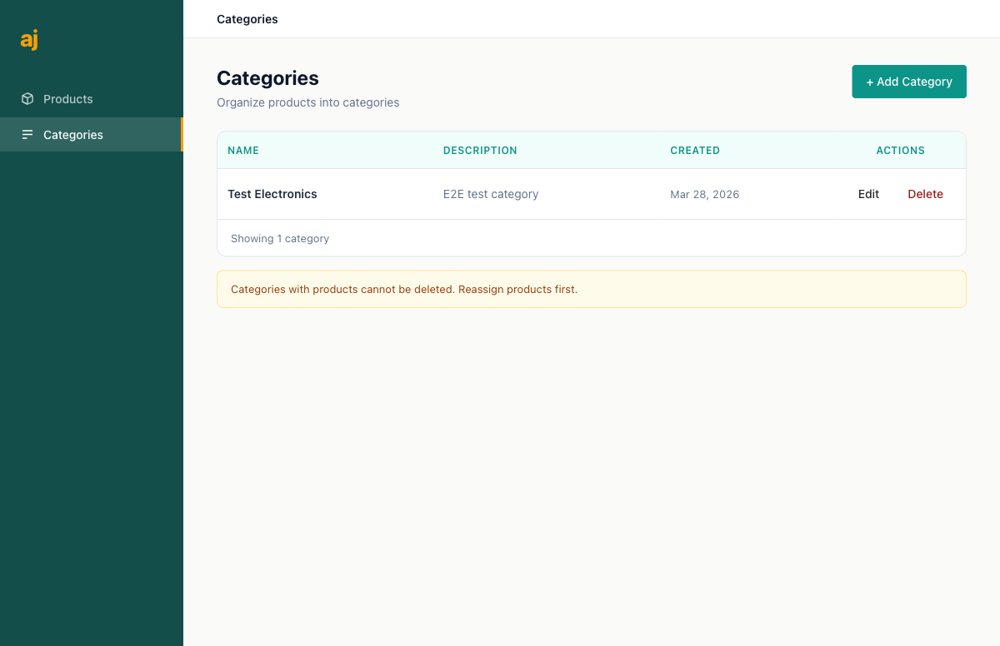
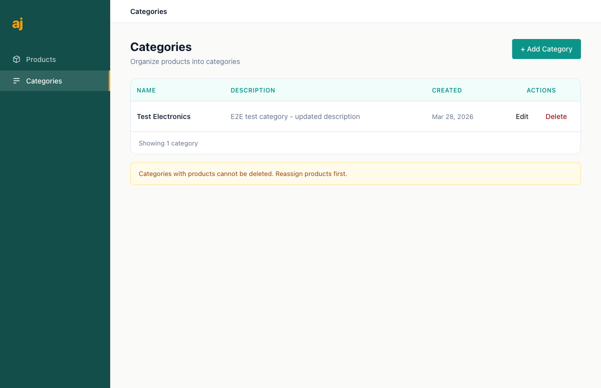
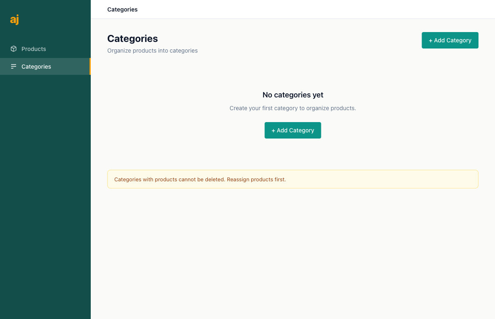
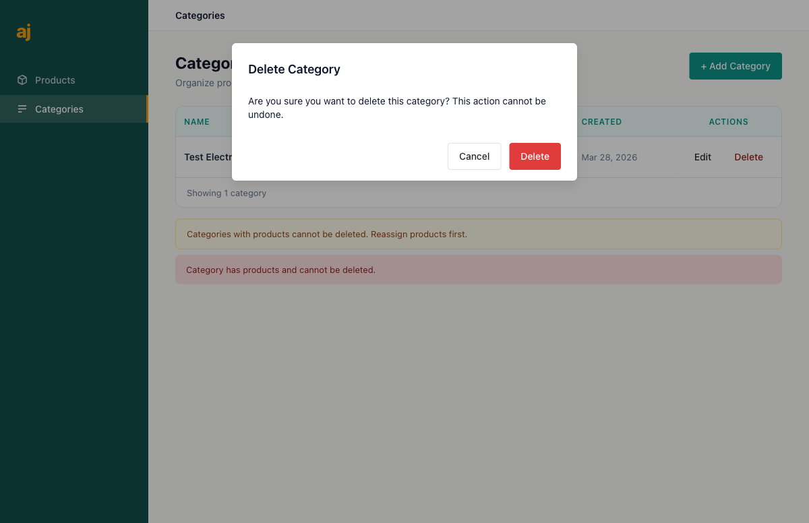
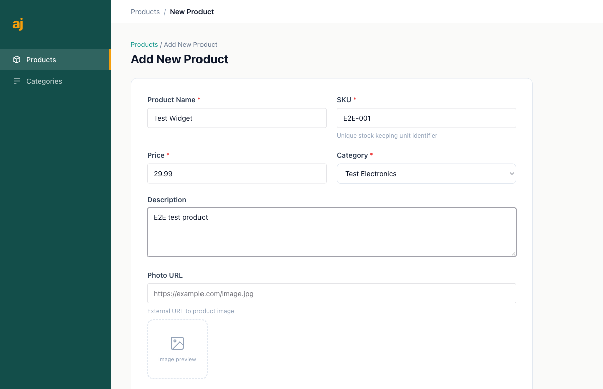
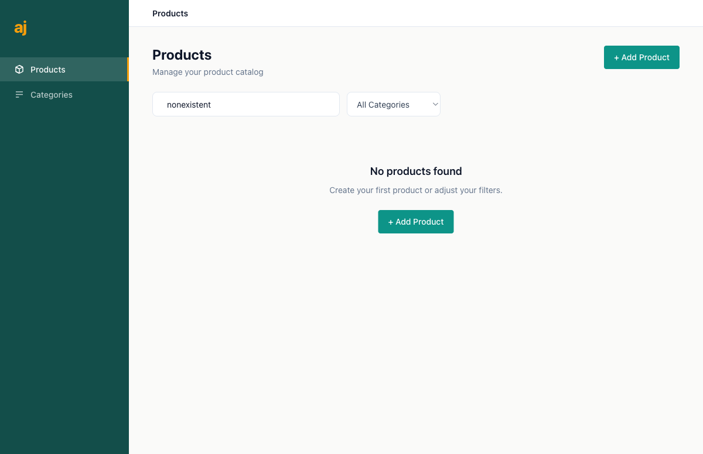
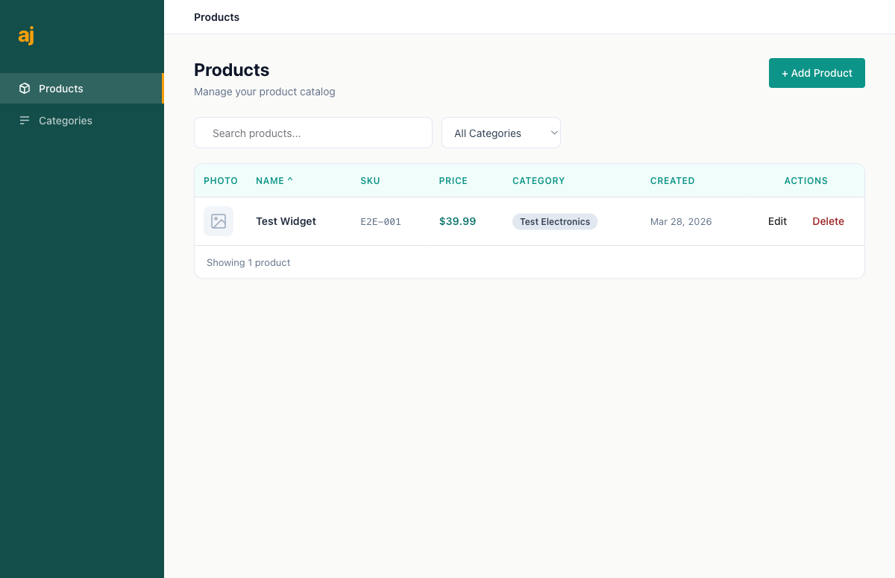
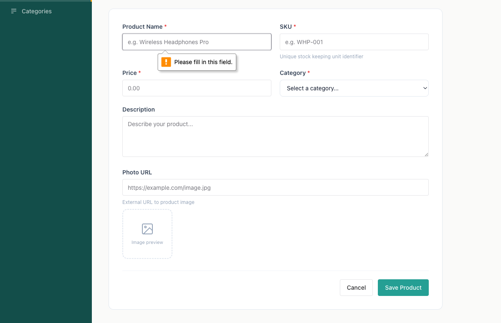
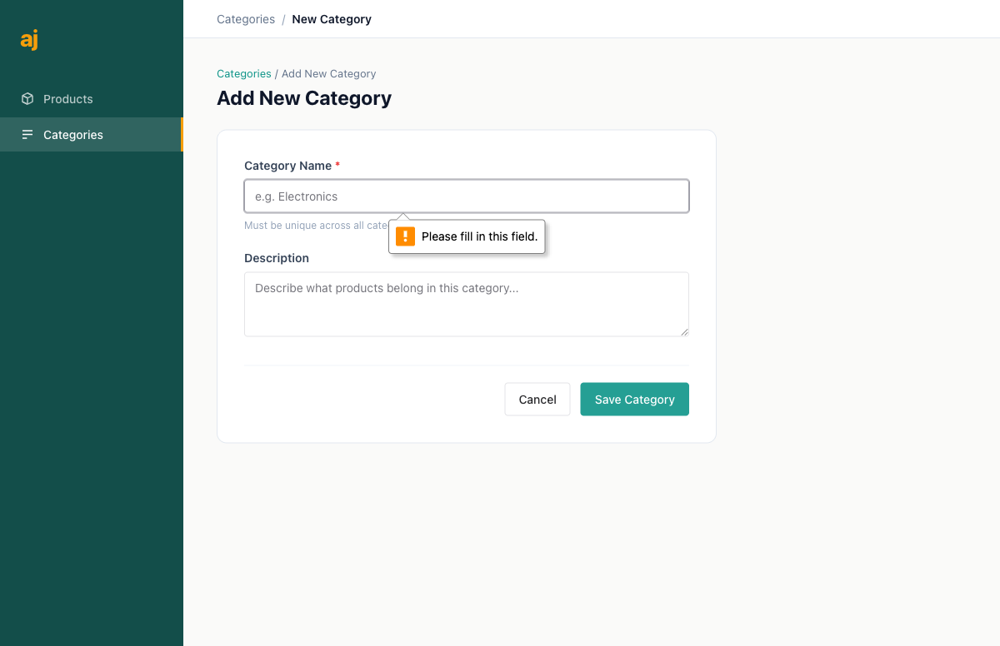

# Product Catalog Management -- User Guide

*Last updated: March 28, 2026*

Welcome to the Product Catalog Management guide. This guide walks you through everything you need to know about organizing your products into categories, adding new products to your catalog, and finding what you need quickly with search and filters.

---

## Table of Contents

1. [Getting Started](#1-getting-started)
2. [Managing Categories](#2-managing-categories)
3. [Managing Products](#3-managing-products)
4. [Searching and Filtering Products](#4-searching-and-filtering-products)
5. [Understanding Error Messages](#5-understanding-error-messages)
6. [Tips and Best Practices](#6-tips-and-best-practices)

---

## 1. Getting Started

### What is the Product Catalog?

The Product Catalog is where you manage all of your products and organize them into categories. You can add products with details like name, price, and a photo link, assign each product to a category, and quickly find products using search and filters.

### Who is this for?

This guide is written for admin users who manage the product catalog. No technical knowledge is required.

### Understanding the Layout

When you open the application, you will see two main areas:

- **Sidebar** (on the left): A dark teal panel with navigation links. You will see two options here -- **Products** and **Categories**. Click either one to switch between the two sections. The currently active section is highlighted with an amber border.

- **Content area** (on the right): This is where you will see your lists, forms, and search tools.

The screenshot above shows what you will see the first time you open the application. The Products page is selected by default, and since you have not added anything yet, you will see a friendly "No products found" message with a button to get started.

### Where to Start

Before you can add products, you need to create at least one category. Categories are like folders that help you organize your products (for example: "Electronics", "Clothing", "Books").

**Recommended first steps:**

1. Go to **Categories** in the sidebar
2. Create your first category
3. Go to **Products** in the sidebar
4. Create your first product and assign it to that category

---

## 2. Managing Categories

Categories help you organize your products into logical groups. Every product must belong to a category, so you will want to set up your categories first.

### Viewing Your Categories

Click **Categories** in the sidebar to see all of your categories.

When you have no categories yet, you will see a "No categories yet" message along with a button to create your first one.

Notice the amber-colored warning banner at the bottom of the page. It reads: *"Categories with products cannot be deleted. Reassign products first."* This is an important rule -- more on that in the [delete protection](#why-you-cannot-delete-some-categories) section below.

Once you have created categories, the page shows a table with four columns:

| Column | What it shows |
|--------|--------------|
| **Name** | The category name |
| **Description** | A short description of what belongs in this category |
| **Created** | The date the category was added |
| **Actions** | Buttons to **Edit** or **Delete** the category |

### Creating a New Category

1. **Click the "+ Add Category" button** in the top-right corner of the Categories page. You can also click the "+ Add Category" button shown in the empty state message.

2. **Fill in the form.** You will see the "Add New Category" form with two fields:

   - **Category Name** (required) -- Give your category a clear, descriptive name. This name must be unique -- no two categories can share the same name. The name can be up to 100 characters long.

   - **Description** (optional) -- Add a short description to help you remember what types of products belong in this category. The description can be up to 500 characters.

   

3. **Click "Save Category"** to create your new category. If you change your mind, click "Cancel" to go back to the list without saving.

   After saving, you will be taken back to the Categories list, where you will see your new category appear in the table.

   

### Editing a Category

1. **Find the category** you want to change in the Categories list.

2. **Click "Edit"** in the Actions column for that category.

3. **Update the fields** you want to change. You can change the name, the description, or both.

4. **Click "Save Category"** to apply your changes.

   You will be taken back to the list where you can see the updated information.

   

### Deleting a Category

1. **Find the category** you want to remove in the Categories list.

2. **Click "Delete"** in the Actions column. A confirmation dialog will appear asking if you are sure.

   

3. **Click "Delete"** in the dialog to confirm, or click "Cancel" to keep the category.

   After successful deletion, the category disappears from the list.

   

### Why You Cannot Delete Some Categories

This is an important safety feature: **you cannot delete a category that still has products assigned to it.** This prevents you from accidentally losing the organization of your product catalog.

If you try to delete a category that has products, you will see a red error message: *"Category has products and cannot be deleted."*

**What to do instead:**

1. Go to the **Products** page
2. Find the products that belong to the category you want to delete
3. Edit each product and assign it to a different category
4. Once no products remain in the original category, go back and delete it

---

## 3. Managing Products

Products are the items in your catalog. Each product has details like a name, a unique SKU code, a price, and a category.

### Viewing Your Products

Click **Products** in the sidebar to see all of your products. The Products page shows a table with the following columns:

| Column | What it shows |
|--------|--------------|
| **Photo** | A small thumbnail of the product image (or a placeholder icon if no photo is set) |
| **Name** | The product name (shown in bold) |
| **SKU** | The unique stock-keeping unit code (shown in a monospace font) |
| **Price** | The product price (shown in teal with a dollar sign) |
| **Category** | The category this product belongs to (shown as a colored badge) |
| **Created** | The date the product was added |
| **Actions** | Buttons to **Edit** or **Delete** the product |

Above the table, you will find a **search box** and a **category filter dropdown** -- these are covered in Section 4.

### Creating a New Product

1. **Click the "+ Add Product" button** in the top-right corner of the Products page.

2. **Fill in the form.** The "Add New Product" form has several fields arranged in a two-column layout:

   - **Product Name** (required) -- The name of your product as you want it to appear in the catalog.

   - **SKU** (required) -- A unique stock-keeping unit identifier. This is typically a short code your team uses to track inventory (for example: "WHP-001" or "BK-NOVEL-042"). Each SKU must be unique across all products.

   - **Price** (required) -- The product price. Enter a number greater than zero (for example: 29.99).

   - **Category** (required) -- Select which category this product belongs to from the dropdown menu. If you do not see any categories, you need to create one first (see Section 2).

   - **Description** (optional) -- A longer text describing the product. Use this for details that help you or your team identify the product.

   - **Photo URL** (optional) -- A web address (URL) pointing to a product image. The form shows an image preview area below this field.

   

3. **Click "Save Product"** to add the product to your catalog. Click "Cancel" to go back without saving.

   After saving, you will be taken to the Products list where your new product appears.

### Editing a Product

1. **Find the product** you want to change in the Products list.

2. **Click "Edit"** in the Actions column for that product.

3. **Update any fields** you want to change. You can change the name, SKU, price, category, description, or photo URL.

4. **Click "Save Product"** to apply your changes.

   You will be taken back to the list where you can verify the updates. In the example below, the price was updated from $29.99 to $39.99:

   

### Deleting a Product

1. **Find the product** you want to remove in the Products list.

2. **Click "Delete"** in the Actions column. A confirmation dialog will appear.

3. **Click "Delete"** to confirm the removal, or "Cancel" to keep the product.

   After deletion, the product is permanently removed from your catalog.

   

---

## 4. Searching and Filtering Products

As your catalog grows, you will want to find products quickly without scrolling through a long list. The Products page provides three ways to narrow down what you see.

### Searching by Name

The **search box** at the top of the Products page lets you search for products by name.

1. **Click inside the search box** (it shows "Search products..." as placeholder text).
2. **Type part of the product name** you are looking for. The list updates automatically as you type.
3. **Clear the search box** to see all products again.

The search is not case-sensitive, so typing "widget", "Widget", or "WIDGET" will all find the same results.

If no products match your search, you will see a "No products found" message with a suggestion to adjust your filters.

### Filtering by Category

The **category dropdown** next to the search box lets you show only products from a specific category.

1. **Click the dropdown** (it shows "All Categories" by default).
2. **Select a category** from the list. Only products in that category will be shown.
3. **Select "All Categories"** again to remove the filter and see everything.

You can combine the category filter with a search -- for example, search for "headphones" within the "Electronics" category.

### Sorting by Column

You can sort the product list by clicking on **column headers** in the table. The columns you can sort by include Name, SKU, Price, and Created date.

- **Click a column header once** to sort in ascending order (A to Z, lowest to highest, oldest to newest).
- **Click the same column header again** to sort in descending order.
- A small arrow indicator appears next to the column name to show which column is being sorted and in which direction.

In the screenshot above, notice the small upward arrow next to "NAME" -- this indicates the list is sorted alphabetically by product name.

---

## 5. Understanding Error Messages

The application validates your input and provides clear messages when something is not right. Here is what you might encounter and what to do about it.

### Required Fields

Fields marked with a red asterisk (*) are required. If you try to save a form without filling in a required field, your browser will show a "Please fill in this field" message pointing to the first empty required field.

**Product form required fields:** Product Name, SKU, Price, Category

**Category form required fields:** Category Name

**What to do:** Fill in all fields marked with an asterisk and try saving again.

### Duplicate Names or SKUs

Category names and product SKUs must be unique. If you try to create a category with a name that already exists, or a product with a SKU that is already in use, you will see an error message.

**What to do:** Choose a different name for your category, or use a different SKU for your product.

### Category Delete Protection

As described in Section 2, you cannot delete a category that still has products. The red error message *"Category has products and cannot be deleted"* appears when you try.

**What to do:** Reassign all products in that category to a different category first, then delete the empty category.

### General Tips for Avoiding Errors

- **Fill in all required fields** before clicking Save.
- **Use unique names** for categories and unique SKUs for products.
- **Check your spelling** in the SKU field -- even a small difference makes a SKU unique.
- **Create categories first**, then products. You cannot create a product without at least one category.

---

## 6. Tips and Best Practices

### Organize Your Categories Thoughtfully

- **Keep category names short and clear** -- "Electronics" is better than "Electronic Items and Gadgets".
- **Use descriptions** to clarify what belongs in each category, especially if the name alone might be ambiguous.
- **Plan your categories before creating products** -- it is easier to organize products from the start than to reorganize later.

### Use Meaningful SKU Codes

- **Create a consistent SKU format** across all products. For example: category abbreviation + product number (like "ELEC-001", "ELEC-002", "BOOK-001").
- **SKUs cannot be changed easily** once assigned, so think about your naming convention before you start adding products.

### Keep Your Catalog Clean

- **Review your catalog regularly** to remove products that are no longer available.
- **Update prices and descriptions** when they change so your catalog stays accurate.
- **Use the search and filter tools** to quickly audit specific categories.

### Navigation Shortcuts

- **Use the breadcrumb links** at the top of forms (like "Categories / Add New Category") to navigate back without losing your place.
- **The sidebar is always visible**, so you can switch between Products and Categories at any time.

---

*Need help with something not covered in this guide? Contact your system administrator for assistance.*
